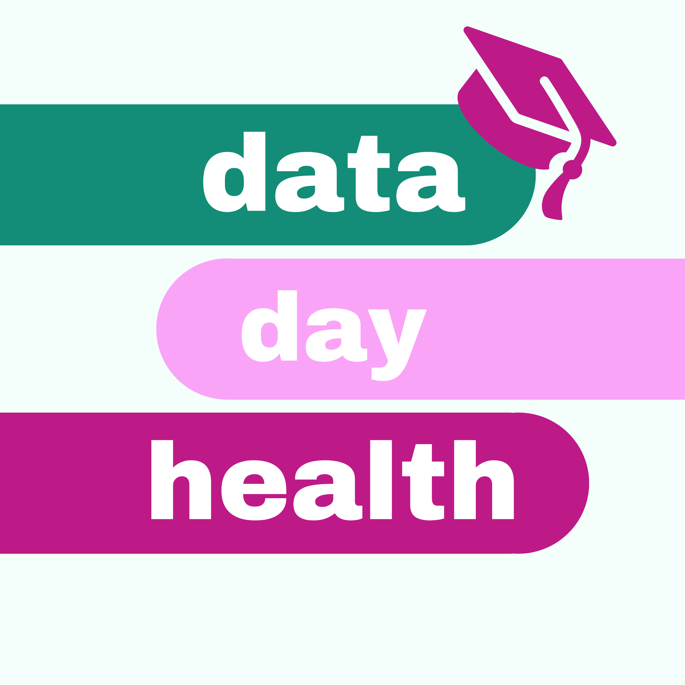

As part of the Turing-Roche Community Scholars Scheme 2023-2024, Florence Townend (PhD student in the lab) made a podcast called Data Day Health, about how data science and AI are changing the healthcare landscape.

### Where to listen
You can listen on [Spotify](https://open.spotify.com/show/2YrjZTXoSAOHFsuQtjgR3z?si=30b48ef133714d2c) and [Apple Podcasts](https://podcasts.apple.com/gb/podcast/data-day-health/id1760541849).

### Episodes
1. Beyond Steps: The Real Power of Smart Watches
    - [Apple](https://podcasts.apple.com/gb/podcast/data-day-health/id1760541849?i=1000664035332)
    - [Spotify]