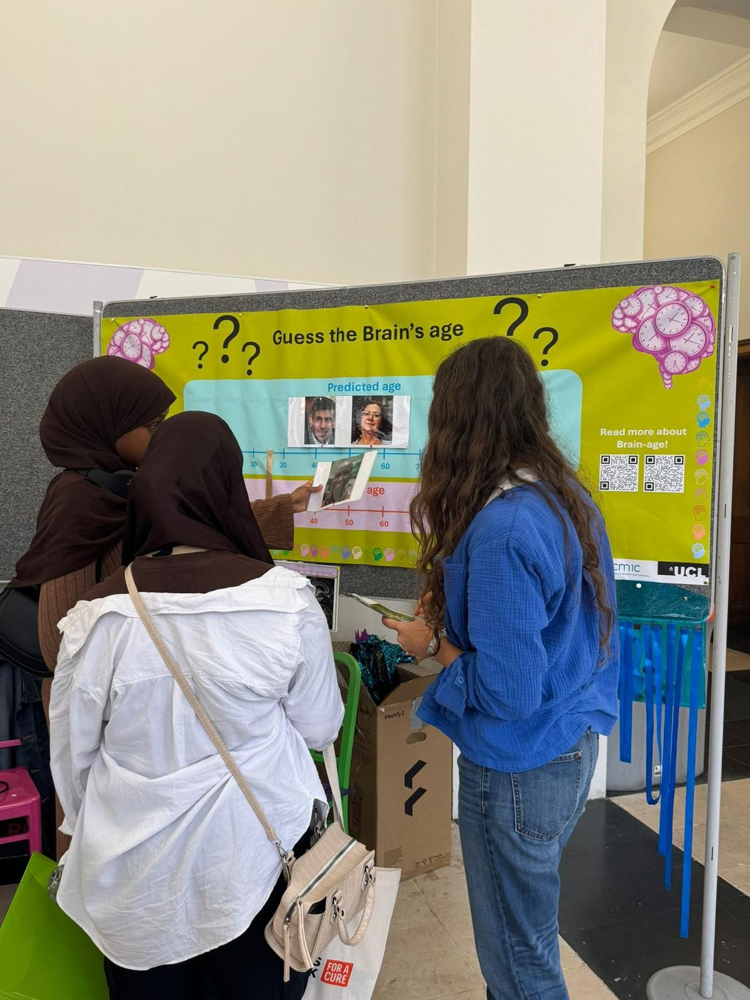
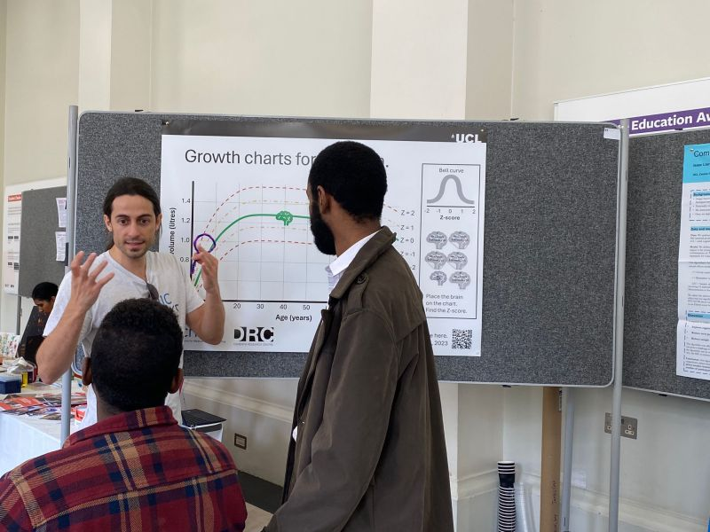

Members of the MANIFOLD Lab* presented our ongoing dementia research to the public during an open day organised by Alzheimer's UK. Through interactive activities, we engaged attendees with our work using brain-age and normative modelling, highlighting how these approaches can contribute to the understanding, diagnosis and prognosis of dementia.

*Fran Biondo, Maitrei Kohli, Sophie Martin & James Cole

## Link to event 
For more details, see [LinkedIn]((https://www.linkedin.com/posts/ucl-centre-medical-image-computing-cmic_well-done-to-the-team-in-cmic-that-showcased-ugcPost-7227597159196430336-eqol?utm_source=share&utm_medium=member_desktop)) 
